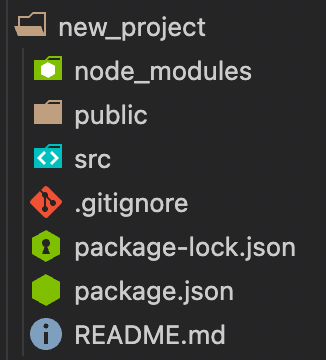
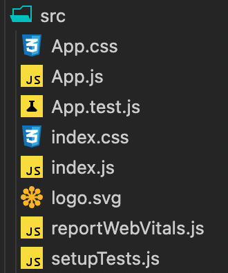
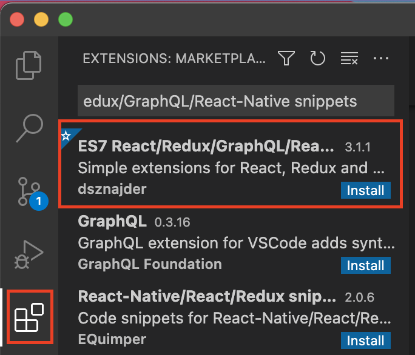
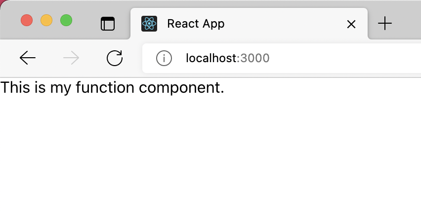
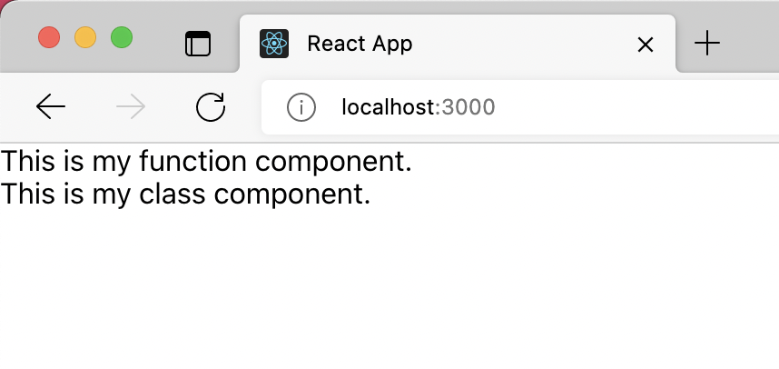

This Guide is a brief of the React v17 Doc.

## Table of Content

- [You need Nodejs to be installed](#you-need-nodejs-to-be-installed)
- [Add React to an existing project](#add-react-to-an-existing-project)
- [Create a new React app](#create-a-new-react-app)
- [Clean up your app](#clean-up-your-app)
- [Organize your project](#organize-your-project)
- [Create your first function component](#create-your-first-function-component)
- [Create your first class component](#create-your-first-class-component)
- [Introduction to JSX](#introduction-to-jsx)
- [Components and Props](#components-and-props)
- [State and Lifecycle](#state-and-lifecycle)
- [Handling Events](#handling-events)
- [Working with forms](#working-with-forms)

## You need Nodejs to be installed

> The purpose of this section is to give you an idea of what tools you need and why you need them. You don't need at this point to know in detail how each tool works. In this section you are not required to do any thing except reading. In the next sections, You will be guided step-by-step to create the React app.

Before you start your journy to creating react apps, you need to make sure that you have `Node.js` installed on your machine. If you do not have it installed go ahead and install it from the official website:

https://nodejs.dev/download

When you install `Node.js`, another tool called `NPM` will be installed with it. `NPM` is short for _**Node Package Manager**_. It is a tool used for installing JavaScript packages into your project.

The `Node.js` on the other hand, is a tool used to run the development environment. For example running the local server, auto generating files ... etc.

The way `NPM` works is by reading the list of the packages that you want to use in your project from a file called `package.json`. You can either create this file manually, or use the following command to auto-generate this file for you:

```
npm init -y
```

Once you have `package.json` created, you can use the following command to install packages:

```
npm install <package-name>
```

When you use `NPM` to install packages, the packages will be installed in a folder called `node_modules`.

You can also notice that any package you install is now listed either under `dependencies` or `devDependencies` section of the `package.json` file.

when you upload your project to your githube repository, you do not need to include the `node_modules` folder. As long as you have `package.json` file in your project, that is all you need to auto-install these packages.

This is why you will notice a file called `.gitignore` is included in your React app when you create a new React project. This file excludes the `node_modules` folder and some other files and folder from being tracked by the git tool. 

## Add React to an existing project

> To go back to **Table of Content**: [click here](#table-of-content)

`JSX` is a JavaScript syntax extension that makes writing React apps easier. To use `JSX`, you need to install some tools that compile your script file that contains `JSX` into a normal JavaScript file that the browser can execute.

First, you need to go to the root folder of your project and create the `package.json` file by running:

```
npm init -y
```

Now you can install the required packages that will be used to compile the file that contains `JSX`. To install the packages run the command:

```
npm install babel-cli@6 babel-preset-react-app@3
```

Next, create a folder called `src`, and inside that folder create a file called `react-script.js` and add the following script in it:

```jsx
ReactDOM.render(
  <h1>Hello, world!</h1>,
  document.getElementById('react-app')
);
```

Next, go to your HTML file and:

1. Create a container for your react component.
2. Add the required script tags to load React.
3. Add the compiled script tag.

```html
    <!-- ... other HTML ... -->

    <!-- Create a container for your react component -->
    <div id="react-app"></div>

    <!-- Add the required script tags to load React -->
    <!-- Note: when deploying, replace "development.js" with "production.min.js". -->
    <script src="https://unpkg.com/react@17/umd/react.development.js" crossorigin></script>
    <script src="https://unpkg.com/react-dom@17/umd/react-dom.development.js" crossorigin></script>

    <!-- Add the compiled script tag -->
    <script src="react-script.js"></script>

</body>
```

The compiled version of `react-script.js` file is not existing yet. You need to run the following command to generate the file:

```
npx babel src --out-dir . --presets react-app/prod
```

You can also use the same command with `--watch` argument to run a live server that watches the changes you make in the `src/react-script.js` file and re-generate the compiled `react-script.js` version of the file every time you hit save.

```
npx babel --watch src --out-dir . --presets react-app/prod
```


## Create a new React app

> To go back to **Table of Content**: [click here](#table-of-content)

To create React apps you need to use a tool called `Create React App`.

The official website of this tool can be found at:

https://create-react-app.dev/

> You do not have to worry about this tool yet. You will be guided step-by-step to create the React app in this section.

All you need to do to create a new React app is to run the following command:

```
npx create-react-app my-app
```

> instead of `my-app` you can choose any name you like. This will be the name of your app.

This is how a new React app file structure looks like:



> The folder you want to focus on is the `src` folder.

Now to start the live server go to the root folder of your app and run:

```
npm start
```

If you want to stop the server press `ctrl + C`.

## Clean up your app

> To go back to **Table of Content**: [click here](#table-of-content)

In the `src` folder you will find the following files:



You can go ahead and delete the following files:

* `App.css`
* `App.test.js`
* `logo.svg`

Next, inside the `App.js` file, delete the following lines:

```jsx
import logo from './logo.svg';
import './App.css';
```

Finally, replace the following JSX code:

```html
<div className="App">
    <header className="App-header">
        
        <p>
            Edit <code>src/App.js</code> and save to reload.
        </p>
        <a
            className="App-link"
            href="https://reactjs.org"
            target="_blank"
            rel="noopener noreferrer"
        >
            Learn React
        </a>
    </header>
</div>
```

with this simple code:

```html
<h1>My first app</h1>
```

Now head to the browser and you should see `My first app` displayed.

## Organize your project

> To go back to **Table of Content**: [click here](#table-of-content)

To make your app more organized, create a new folder called `components` inside the `src` folder to contain the React components that you will create later.

## VSCode React useful extension

> To go back to **Table of Content**: [click here](#table-of-content)

Insall the following VSCode extension to help you with creating your components:

Extension name: `ES7 React/Redux/GraphQL/React-Native snippets`



This extension contains a set of useful snippets that we can use to quickly create components.

Two snippet prefixes to remember are:

* `rce`: creates a class-based component.
* `rfce`: creates a function-based component.

## Create your first function component

> To go back to **Table of Content**: [click here](#table-of-content)

Inside the `components` folder, create a new file called `MyFunctionComponent.js`.

Now let's use the snippet provided by the extension that we installed in the previous section to create a function component.

Inside the `MyFunctionComponent.js` file, write `rfce` and hit the `Tab` button.

Next, add the following text `This is my function component.` inside the JSX `<div>`.

Your component should now look like this:

```jsx
import React from 'react'

function MyFunctionComponent() {
    return (
        <div>
            This is my function component.
        </div>
    )
}

export default MyFunctionComponent
```

Now head to `App.js` file and import this component, and use it as shown in the code below:

```jsx
import MyFunctionComponent from './components/MyFunctionComponent';

function App() {
  return (
    <div>
      <MyFunctionComponent />
    </div>
  );
}

export default App;
```

Now when you head to your browser you should see something like this:



## Create your first class component

> To go back to **Table of Content**: [click here](#table-of-content)

In the previous section we created a React component using a JavaScript function. In this section we will create another component, but this time we will use a JavaScript class.

Inside the `components` folder, create a new file called `MyClassComponent.js`, and inside this file write `rce` and hit the `Tab` button.

Next, add the following text `This is my class component.` inside the JSX `<div>`.

Your component should now look like this:

```jsx
import React, { Component } from 'react'

class MyClassComponent extends Component {
    render() {
        return (
            <div>
                This is my class component.
            </div>
        )
    }
}

export default MyClassComponent
```

> Don't forget to remove the export keyword which is placed before the class keyword.

Now head to `App.js` file and import this component, and use it as shown in the code below:

```jsx
import MyFunctionComponent from './components/MyFunctionComponent';
import MyClassComponent from './components/MyClassComponent';

function App() {
  return (
    <div>
      <MyFunctionComponent />
      <MyClassComponent />
    </div>
  );
}

export default App;
```

Now when you head to your browser you should see something like this:



## Introduction to JSX

> To go back to **Table of Content**: [click here](#table-of-content)

JSX looks like HTML but it is not HTML. It is a syntax extension to JavaScript, and you can put any valid JavaScript expression inside the curly braces in JSX.

> You may create a new function component called `MyComponent` to try the following examples. Don't forget to import it and use it in the `App.js` file as explained in the previous sections.

In the following example, we are using the variable `name` in the JSX `<div>` to display a person name:

```jsx
const name = "Ali Abdulaziz"

function MyComponent() {
    return (
        <div>My Name is {name}</div>
    )
}
```

Here is another example, in which we are using the array `map()` method to create an unordered list:

```jsx
const hobbies = ["Reading", "Programming", "Playing video games"];

function MyComponent() {
    return (
        <ul>
            {
                hobbies.map(hobby => <li>{hobby}</li>)
            }
        </ul>
    )
}
```

You can use functions too:

```jsx
function formatName(user) {
    return user.firstName + ' ' + user.lastName;
}

const user = {
    firstName: 'Harper',
    lastName: 'Perez'
};

function MyComponent() {
    return (
        <div>
            Hello, {formatName(user)}
        </div>
    )
}
```

Here is an example of using `if statement`:

```jsx
function getGreeting(user) {
    if (user) {
        return <h1>Hello, {user}!</h1>;
    }
    return <h1>Hello, Stranger.</h1>;
}

function MyComponent() {
    return getGreeting("Ali Abdulaziz");
}
```

You can also use inline if with (Logical && Operator):

```jsx
function MyComponent(props) {
    const unreadMessages = props.unreadMessages;
    return (
        <div>
        <h1>Hello!</h1>
        {unreadMessages.length > 0 &&
            <h2>
            You have {unreadMessages.length} unread messages.
            </h2>
        }
        </div>
    );
}
```

It works because in JavaScript, `true && expression` always evaluates to `expression`, and `false && expression` always evaluates to `false`.

### What about attributes?

You can use qoutes to specify attributes like in normal HTML.

```jsx
function MyComponent() {
    return ;
}
```

However, you can also use variables:

```jsx
const imageUrl = "https://image.flaticon.com/icons/png/128/769/769609.png";

function MyComponent() {
    return ;
}
```

> Since JSX is closer to JavaScript than to HTML, React DOM uses camelCase property naming convention instead of HTML attribute names. For example, class becomes className in JSX,

Hopefully, now you have a well understanding of how to use expressions and statements in JSX.

## Components and Props

> To go back to **Table of Content**: [click here](#table-of-content)

Conceptually, components are like JavaScript functions. They accept arbitrary inputs called `props` and return React elements describing what should appear on the screen.

So let's take an example of how to use props.

Create a new file in `src/components` folder called `Welcome.js`.

Now use the `rcfe` snippet prefix to create the following function component:

```jsx
function Welcome(props) {
    return (
        <div>
            Hello, {props.userName}
        </div>
    )
}

export default Welcome
```

If you like, you can modify the example and use the **destructuring assignment** syntax. If you don't know or remember what the **destructuring assignment** syntax is, go ahead and read about it:

https://developer.mozilla.org/en-US/docs/Web/JavaScript/Reference/Operators/Destructuring_assignment

```jsx
function Welcome({userName}) {
    return (
        <div>
            Hello, {userName}
        </div>
    )
}

export default Welcome
```

Now import it and use in `App.js` as following:

```jsx
import Welcome from './components/Welcome';

function App() {
  return (
    <div>
      <Welcome userName="Ali Abdulaziz" />
    </div>
  );
}
```

Notice how we passed the user name to the component using the `userName` prop. Ofcourse, you can use as many props as you want.

In class components we access `props` as following:

```jsx
import React, { Component } from 'react'

class Welcome extends Component {
    render() {
        return <h1>Hello, {this.props.name}</h1>;
    }
}
```

### Props are Read-Only

Whether you declare a component as a function or a class, it must never modify its own props. Consider this `sum` function:

```jsx
function sum(a, b) {
    return a + b;
}
```

Such functions are called `pure` because they do not attempt to change their inputs, and always return the same result for the same inputs.

In contrast, this function is impure because it changes its own input:

```jsx
function withdraw(account, amount) {
    account.total -= amount;
}
```

React is pretty flexible but it has a single strict rule:

**All React components must act like pure functions with respect to their props.**

Of course, application UIs are dynamic and change over time. In the next section, we will introduce a new concept of `state`. State allows React components to change their output over time in response to user actions, network responses, and anything else, without violating this rule.

## State and Lifecycle

> To go back to **Table of Content**: [click here](#table-of-content)

**State** is similar to props, but unlike props, state is private and fully controlled by the component.

Neither parent nor child components can know if a certain component is stateful (has a state) or stateless (does not have a state). This is why state is often called local or encapsulated, because the state is not accessible to any component other than the one that owns and sets it.

However, A component may choose to pass its state down as props to its child components as we will see later.

To use `state` in a function component we need to use **Hooks**, but because we did not cover hooks yet we will use a class component in the following examples.

Create a new file in `src/components` folder called `Clock.js` and paste the following snippet in it:

```jsx
import React, { Component } from 'react'

class Clock extends Component {
    constructor(props) {
        super(props);
        this.state = {date: new Date()};
    }

    componentDidMount() {
        this.timerID = setInterval(() => this.tick(), 1000);
    }

    componentWillUnmount() {
        clearInterval(this.timerID);
    }

    tick() {
        this.setState({ date: new Date() });
    }

    render() {
        return (
        <div>
            <h1>Hello, world!</h1>
            <h2>It is {this.state.date.toLocaleTimeString()}.</h2>
        </div>
        );
    }
}

export default Clock
```

This is a clock component which prints the time on the screen and updates every second.

> Don't forget to import the component into the `App.js` if you want to test it.

Now let's try to understand what is going on here.

### Initializing state inside the constructor

As you can see, we started by initializing (assigning a value to) the state inside the constructor as following:

```jsx
constructor(props) {
    super(props);
    this.state = {date: new Date()};
}
```

This is something you need to remember. Whenever you need to initialize something inside a React class component's constructor you must always pass the `props` to the constructor as well as the parent's constructor using the `super` keyword even if the component doesn't use any props.

> You can omit the constructor in class components if you are not using `state`, but you must include the constructor if you want to use `state`.

### Lifecycle methods

In the example above, we used the following special methods:

```jsx
componentDidMount() 
```

```jsx
componentWillUnmount()
```

These methods, which are provided for us by React, are called **lifecycle methods**. To understand what these methods do, we need to understand what **mounting** and **unmounting** mean.

**Mounting**: is happening whenever a component is rendered to the DOM for the first time.

**Unmounting**: is happening whenever the DOM produced by the component is removed.

Imagine the `render()` method in the class component as a printer. The printer needs to receive all the necessary data about the document or the image to be printed before it starts printing it. The same idea applys to components. Any data used to produce the component's output needs to be initialized before the `render()` method executes. This is why we need to initialize the `state` inside the constructor. 

> _Remember, in JavaScript the constructor enables you to provide any custom initialization that must be done before any other methods can be called on an instantiated object._

Once all data is initialized, the `render()` method executes and prints the result on the screen.

Now because our component is a clock which must update every second, we need a way to update the printed result every second. This is why we used the `setInterval()`.

> If you don't know or remember what `setInterval()` does go ahead and read about it: <br> https://developer.mozilla.org/en-US/docs/Web/API/WindowOrWorkerGlobalScope/setInterval

The `componentDidMount()` method runs after the component output has been rendered to the DOM. This is why it is considered a good place to set up the timer as we did in the example.

```jsx
componentDidMount() {
    this.timerID = setInterval(() => this.tick(), 1000);
}
```

the `tick()` is just a regular method that we defined to set a new value to the state. 

Here is an important thing you should remember. **We cannot directly assign a new value to the state like we did in the constructor.** 

I mean like this:

```jsx
this.state = {date: new Date()};
```

Because if we did that, React will have no idead that we changed the state value. React needs to be notified about the state change so it runs the `render()` method again to print the new output (which includes the new state).

This is why React provides us with the `setState()` method. You need to set the state using this method like this:

```JSX
this.setState({ date: new Date() });
```

Another important thing to remember is to **never call the `setState()` method inside the `render()` method** because this will cause an infinite loop!

Finally, the `componentWillUnmount()` method runs immediately before the DOM produced by the component is removed (destroyed). Therefore, it is the best place to stop the timer.

```jsx
componentWillUnmount() {
    clearInterval(this.timerID);
}
```

### State Updates May Be Asynchronous

For performance reasons, React may update `this.props` and `this.state`  asynchronously. This is why you should not rely on their values for calculating the next state.

For example, this code may fail to update the counter:

```jsx
// Wrong
this.setState({
    counter: this.state.counter + this.props.increment,
});
```

To fix it, use a second form of `setState()` that accepts a function rather than an object:

```jsx
// Correct
this.setState((state, props) => ({
    counter: state.counter + props.increment
}));
```

We used an arrow function above, but it also works with regular functions.

## Handling Events

> To go back to **Table of Content**: [click here](#table-of-content)

As you already know, to handle event on DOM elements you can do something like:

```html
<button onclick="activateLasers()">
    Activate Lasers
</button>
```

You can also use `addEventListener()` like this:

```js
button.addEventListener(('click', activateLasers);
```

This is how we used to handle events in vanilla JavaScript.

Handling events with React elements is very similar but with a few differences.

For example, in React however, we don't use the `addEventListener()` to handle events. We also don't pass the handler function as a string like we did in the first example. Instead we pass the handler as a function.

Take a look at the following example:

```jsx
<button onClick={activateLasers}>
    Activate Lasers
</button>
```

> Notice that React events are named using camelCase, rather than lowercase.

A common mistake usually made by beginners is passing a function call instead of a function:

```jsx
// Wrong
<button onClick={activateLasers()}>
    Activate Lasers
</button>
```

```jsx
// Correct
<button onClick={activateLasers}>
    Activate Lasers
</button>
```

### Binding this to handler

Consider the following example:

```jsx
class Toggle extends React.Component {
    constructor(props) {
        super(props);
        this.state = {isToggleOn: true};

        this.handleClick = this.handleClick.bind(this);
    }

    handleClick() {
        this.setState(prevState => ({
            isToggleOn: !prevState.isToggleOn
        }));
    }

    render() {
        return (
        <button onClick={this.handleClick}>
            {this.state.isToggleOn ? 'ON' : 'OFF'}
        </button>
        );
    }
}
```

This is a class component which has an event handler called `handleClick`. This handler runs when the user clicks on the button. The handler toggles the value of `this.state.isToggleOn` between `true` and `false` using the `setState()` because `setState()` is what we use to update the state value as we already learned in the previous section.

So based on the value of `this.state.isToggleOn` the text on the button will toggle between `ON` and `OFF`.

But did you notice the following line in the constructor?

```jsx
this.handleClick = this.handleClick.bind(this);
```

This is what we mean by binding `this`. <b style="background-color: yellow; color: black; padding: 5px;">In JavaScript, class methods are not bound by default. This is why we need to use the `bind()` method to bind them</b>. If you forget to bind `this.handleClick` and pass it to `onClick`, `this` will be `undefined`.

To understand what `bind()` does consider the following example which is taken from the MDN Web Docs:

```js
const module = {
    x: 42,
    getX: function() {
        return this.x;
    }
};

const unboundGetX = module.getX;
console.log(unboundGetX()); // The function gets invoked at the global scope
// expected output: undefined

const boundGetX = unboundGetX.bind(module);
console.log(boundGetX());
// expected output: 42
```

> So remember to bind the event handler when you use `this` inside the handler. Otherwise, `this` will be `undefined`.

You can also bind the handler inline:

```jsx
render() {
    return (
        <button onClick={this.handleClick.bind(this)}>
            {this.state.isToggleOn ? 'ON' : 'OFF'}
        </button>
    );
}
```

If you are bothered by binding `this` to the handler, there are other ways to pass the handler to `onClick` (or other events) without the need of binding the handler.

METHOD (1): using arrow function:

```jsx
render() {
    return (
        <button onClick={() => this.handleClick()}>
            {this.state.isToggleOn ? 'ON' : 'OFF'}
        </button>
    );
}
```

METHOD (2): using public class fields syntax:

```jsx
// public class fields syntax
handleClick = () => {
    this.setState(prevState => ({
        isToggleOn: !prevState.isToggleOn
    }));
}

render() {
    return (
        <button onClick={this.handleClick}>
            {this.state.isToggleOn ? 'ON' : 'OFF'}
        </button>
    );
}
```

### Passing Arguments to Event Handlers

You can use inline binding or arrow functiong to pass arguments:

```jsx
<button onClick={(e) => this.deleteRow(id, e)}>Delete Row</button>
<button onClick={this.deleteRow.bind(this, id)}>Delete Row</button>
```

## Working with forms

> To go back to **Table of Content**: [click here](#table-of-content)

In React we usually have a JavaScript function that handles the submission of a form and has access to the data that the user entered into the form.

The standard way to achieve this is with a technique called **controlled components**, in which the values of the form input elments are controlled by React. This way the React state becomes the “single source of truth”.

In HTML, form elements such as `<input>`, `<textarea>`, and `<select>` typically maintain their own state and update it based on user input. In React, mutable state is typically kept in the state property of components, and only updated with `setState()`.

Let's take an example:

```jsx
import React, { Component } from 'react'

class MyForm extends Component {
    constructor(props) {
        super(props)
        this.state = {input: ""};
        this.handleChange = this.handleChange.bind(this);
    }

    handleChange(event) {
        this.setState({input: event.target.value});
    }

    render() {
        return (
            <form>
                <label>
                    User Input: 
                    <input type="text" value={this.state.name} onChange={this.handleChange} />
                </label>
                <p>{this.state.input}</p>
            </form>
        )
    }
}

export default MyForm
```

This class component reads whatever user types in the input field and prints the value in a `<p>` element.

We used `onChange` event to trigger the handler on every change occures to the input value. The handler simply uses the `setState()` to update the value of `this.state.input`.

This is how we read the values from the form fields in React (we use `onChange` event and a handler to assign the fields values to the component state).

### The textarea element

In HTML, a `<textarea>` element defines its value by its inner text as following:

```jsx
<textarea>Hello there, this is some text in a text area</textarea>
```

So how are we going to set and read its value?

In React, there is no difference between `<input>` and `<textarea>` in terms of setting or reading values. Yes, in HTML, `<textarea>` does not have a `value` attribute that sets it value, but in React it does have.

Example of ( reading / setting ) a value in `<input>`:

```jsx
<input type="text" value={this.state.name} onChange={this.handleChange} />
```

Example of ( reading / setting ) a value in `<textarea>`:

```jsx
<textarea value={this.state.value} onChange={this.handleChange} />
```

As you can see there is no difference.

### The select Tag

In HTML we add `select` attribute to select an `<option>` in the `<select>` element. For instance, **coconut** will be selected in the following example:

```html
<select>
    <option value="grapefruit">Grapefruit</option>
    <option value="lime">Lime</option>
    <option selected value="coconut">Coconut</option>
    <option value="mango">Mango</option>
</select>
```

The question is how can we do that in React?

We can do that in React using the `value` attribute.

First you set the initial value (the selected value) in the constructor:

```jsx
constructor(props) {
    super(props);
    this.state = {value: 'coconut'};

    // ... the rest of the code
}
```

Then you use this state on the `<select>` as following :

> The part we want to focus on here is `value={this.state.value}`.

```jsx
<select value={this.state.value} onChange={this.handleChange}>
    <option value="grapefruit">Grapefruit</option>
    <option value="lime">Lime</option>
    <option value="coconut">Coconut</option>
    <option value="mango">Mango</option>
</select>
```

As you can see it is similar to `<input>` and `<textarea>`. In React, we almost always use the `value` attribute to set the value of the field and `onChange` to keep eye on what the user enters or selects.

### Handling Multiple Inputs

This is the beutiful part. If you want to handle multiple values, instead of defining an event handler for each field you can use one dynamic event handler which can be used by all fields as following:

```jsx
import React, { Component } from 'react'

class Reservation extends Component {
    constructor(props) {
        super(props);
        this.state = {
            isGoing: true,
            numberOfGuests: 2
        };

        this.handleInputChange = this.handleInputChange.bind(this);
    }

    handleInputChange(event) {
        const target = event.target;
        const value = target.type === 'checkbox' ? target.checked : target.value;
        const name = target.name;

        this.setState({
            [name]: value
        });
    }

    render() {
        return (
            <form>
                <label>
                    Is going:
                    <input
                        name="isGoing"
                        type="checkbox"
                        checked={this.state.isGoing}
                        onChange={this.handleInputChange} />
                </label>
                <br />
                <label>
                    Number of guests:
                    <input
                        name="numberOfGuests"
                        type="number"
                        value={this.state.numberOfGuests}
                        onChange={this.handleInputChange} />
                </label>
            </form>
        );
    }
}
```

The part you want to focus on here is:

```jsx
handleInputChange(event) {
    const target = event.target;
    const value = target.type === 'checkbox' ? target.checked : target.value;
    const name = target.name;

    this.setState({
        [name]: value
    });
}
```

This event handler is being used by both of the following fields:

The (Is going) field:
```jsx
<input
    name="isGoing"
    type="checkbox"
    checked={this.state.isGoing}
    onChange={this.handleInputChange} />
```

And the (Number of guests) field:

```jsx
<input
    name="numberOfGuests"
    type="number"
    value={this.state.numberOfGuests}
    onChange={this.handleInputChange} />
```

This is all done because of these two lines:

```jsx
const name = target.name;

this.setState({
    [name]: value
});
```

As you can see we are using the `target.name` to figure out which field is triggering the handler. the `target.name` will return `isGoing` if the (Is going) field is the one which is triggering the handler, and `numberOfGuests` if the (Number of guests) field is the one which is triggering the handler.

Finally, we are using the name of the field to dynamically update the state value:

```jsx
this.setState({
    [name]: value
});
```

**Notice**: This only works in ES6. In ES5 you need to write the code as following:

```jsx
var partialState = {};
partialState[name] = value;
this.setState(partialState);
```

Since `setState()` automatically merges a partial state into the current state, we only needed to call it with the changed parts.

### Formik library

Once you feel confortable with building forms using controlled components, you may want to take a look on "Formik" library. It is a tool a complete solution including validation, keeping track of the visited fields, and handling form submission:

https://formik.org/

You don't need to worry about using this library yet. You can learn about it later once we finish covering all basic topics in React.


